# ℹ Information

|    Distro    |                                                 [Arch](https://archlinux.org/)                                                  |
|:------------:|:-------------------------------------------------------------------------------------------------------------------------------:|
|      WM      |                                          [BSPWM](https://github.com/baskerville/bspwm)                                          |
|     Bar      |                                          [Polybar](https://github.com/polybar/polybar)                                          |
|     Menu     |                                           [Rofi](https://github.com/davatorium/rofi)                                            |
|  Compositor  |                         [Picom-animations-git](https://aur.archlinux.org/packages/picom-animations-git)                         |
|   Terminal   |                                          [Kitty](https://github.com/kovidgoyal/kitty)                                           |
| Music/Player |                                      [Spotify](https://aur.archlinux.org/packages/spotify)                                      |
| File Manager |                                  [Thunar](https://archlinux.org/packages/extra/x86_64/thunar/)                                  |
|    Shell     |                                     [Zsh](https://archlinux.org/packages/extra/x86_64/zsh/)                                     |
|  Aur Helper  |                                           [Paru](https://github.com/Morganamilo/paru)                                           |

# Screenshots

# Nvim
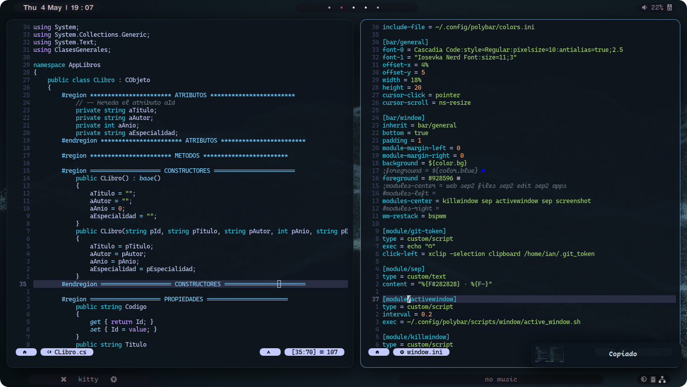
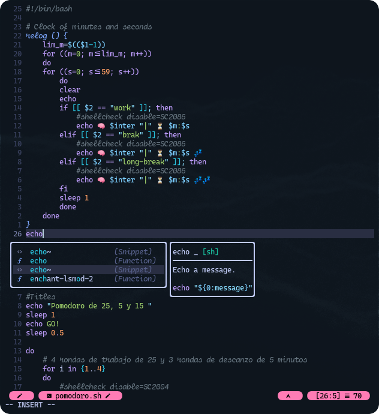

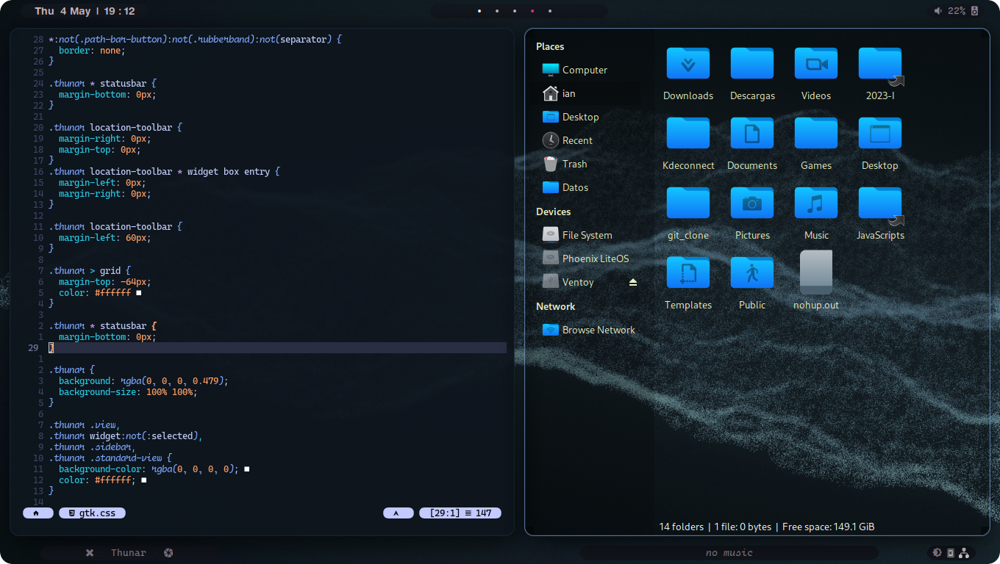

# Rofi
## Applications menu 

## Run commands or scripts
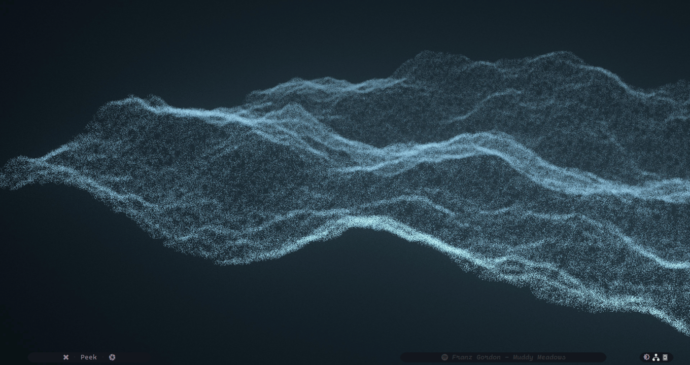
## Emoji menu
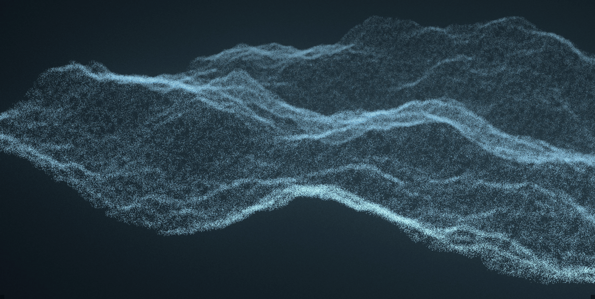
## Power menu
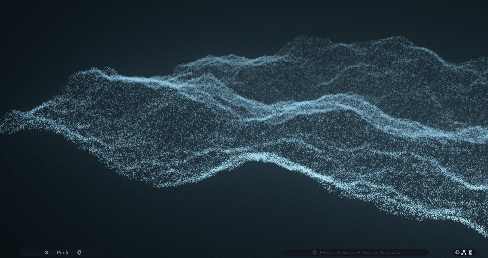

## Spotify
%% 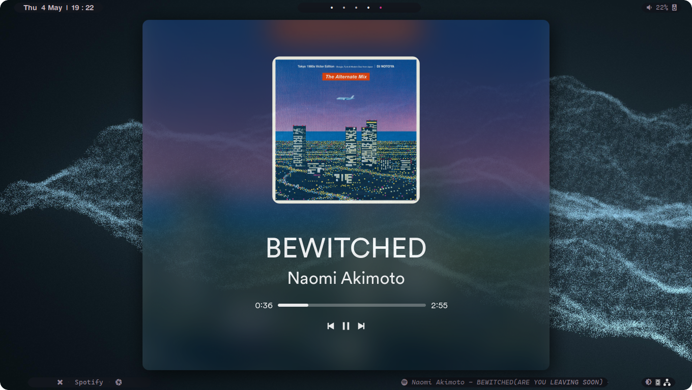
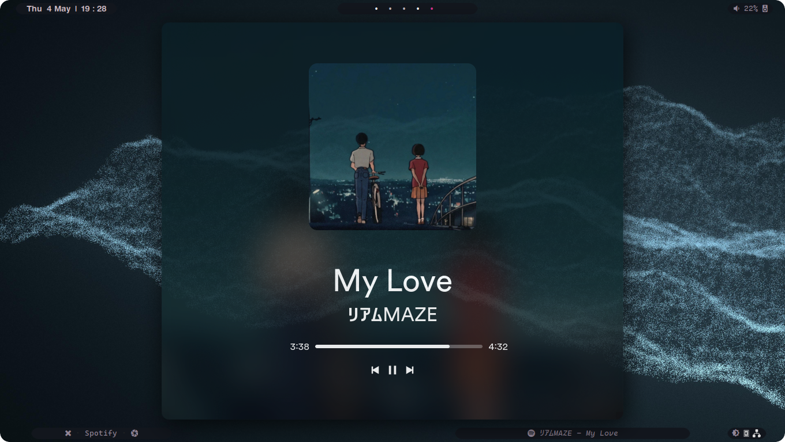
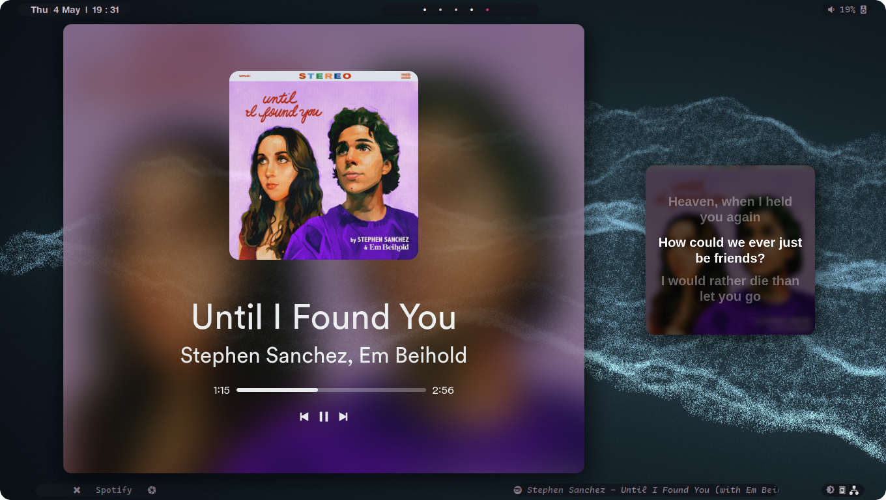
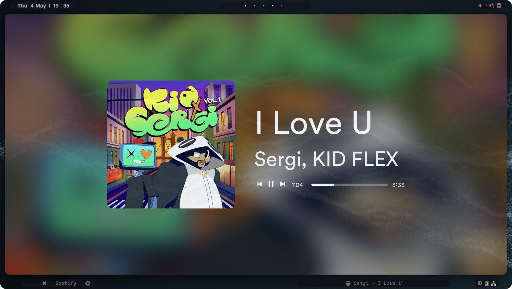
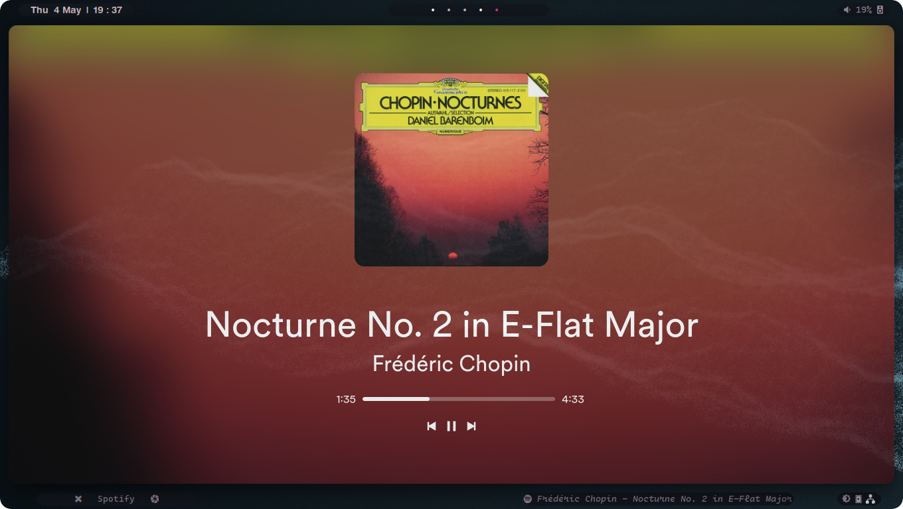
%% 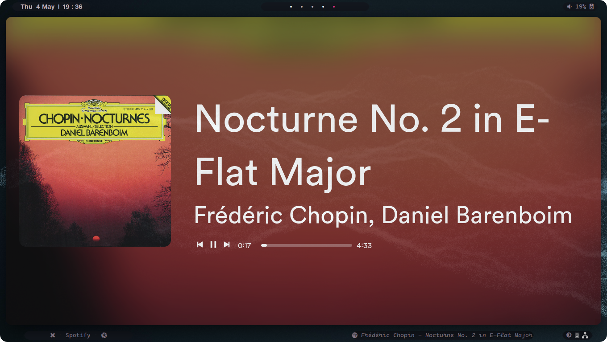

## Lightdm 

## Plymouth

